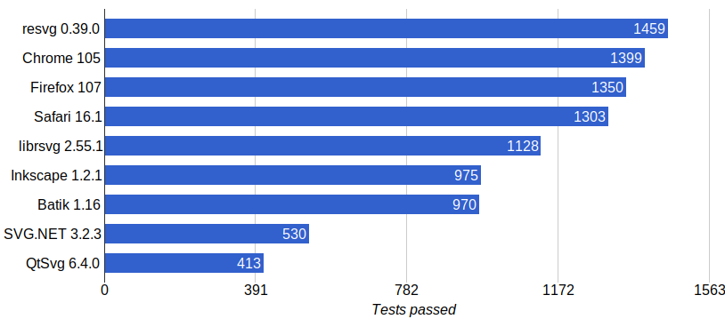
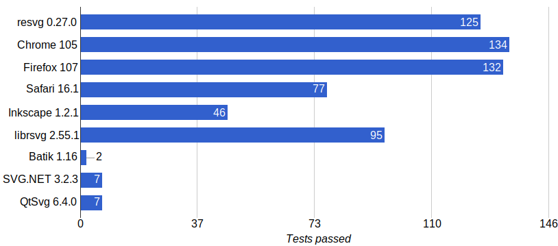

## resvg

*resvg* is an [SVG](https://en.wikipedia.org/wiki/Scalable_Vector_Graphics) rendering library.

## Purpose

`resvg` can be used as a Rust library, a C library and as a CLI application
to render SVG files based on a
[static](http://www.w3.org/TR/SVG11/feature#SVG-static)
[SVG Full 1.1](https://www.w3.org/TR/SVG11/) subset.

The core idea is to make a fast, small, portable SVG library designed for edge-cases.
Right now, a `resvg` CLI application is less than 3MiB and doesn't require any external dependencies.

Another major difference from other SVG rendering libraries is that `resvg` does a lot
of preprocessing before rendering. It converts an input SVG into a simplified one
called [Micro SVG](./docs/usvg_spec.adoc) and only then it begins rendering.
So it's very easy to implement a new rendering backend.
But we officially support only one.
And you can also access *Micro SVG* as XML directly via the [usvg](./usvg) tool.

## SVG support

`resvg` is aiming to support only the [static](http://www.w3.org/TR/SVG11/feature#SVG-static)
SVG subset; e.g. no `a`, `script`, `view` or `cursor` elements, no events and no animations.

[SVG 2.0](https://www.w3.org/TR/SVG2/) support is in progress.
See [#393](https://github.com/RazrFalcon/resvg/issues/393)

[SVG Tiny 1.2](https://www.w3.org/TR/SVGTiny12/) is not supported and not planned.

Results of the [resvg test suite](./tests/README.md):

SVG 2 only results:

You can find a complete table of supported features
[here](https://razrfalcon.github.io/resvg-test-suite/svg-support-table.html).
It also includes alternative libraries.

## Performance

Comparing performance between different SVG rendering libraries is like comparing
apples and oranges. Everyone has a very different set of supported features,
implementation languages, build flags, etc.
But since `resvg` is written in Rust and uses [tiny-skia] for rendering - it's pretty fast.

## Safety

resvg and most of its dependencies are pretty safe.
The main exception is fonts memory mapping.

## License

`resvg` project is licensed under the [MPLv2.0](https://www.mozilla.org/en-US/MPL/).

[rustybuzz]: https://github.com/RazrFalcon/rustybuzz
[tiny-skia]: https://github.com/RazrFalcon/tiny-skia
