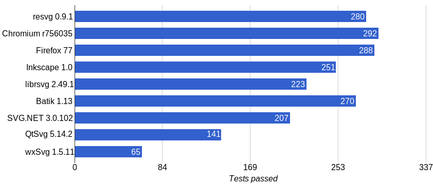
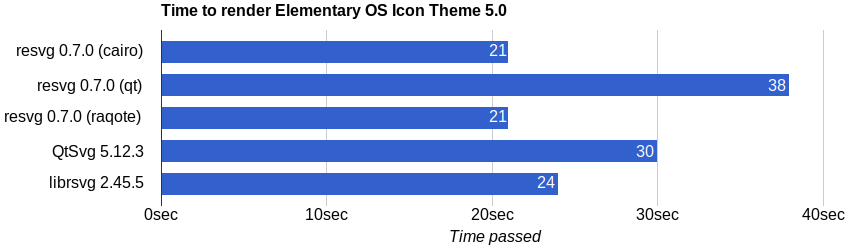
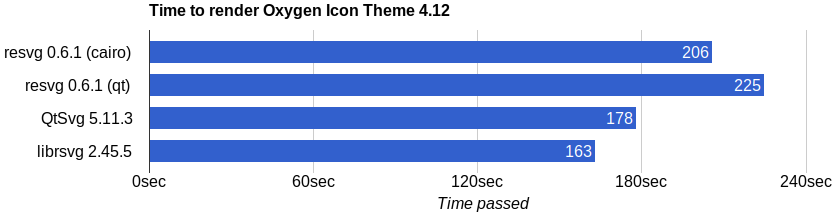

## resvg

*resvg* is an [SVG](https://en.wikipedia.org/wiki/Scalable_Vector_Graphics) rendering library.

## Purpose

*resvg* can be used as:

- a Rust library
- a C library (see [capi](./capi))
- a CLI application (see [tools/rendersvg](./tools/rendersvg))

to render SVG files based on a
[static](http://www.w3.org/TR/SVG11/feature#SVG-static)
[SVG Full 1.1](https://www.w3.org/TR/SVG/Overview.html) subset to raster images or
to a backend's canvas (e.g. to a QWidget via QPainter).

The core idea is to make a fast, small, portable, multiple-backend SVG library
designed for edge-cases.

Another major difference from other SVG rendering libraries is that *resvg* does a lot
of preprocessing before rendering. It converts an input SVG into a simplified one
called [Micro SVG](./docs/usvg_spec.adoc) and only then it begins rendering.
So it's very easy to implement a new rendering backend.
And you can also access *Micro SVG* as XML directly via [usvg](./tools/usvg) tool.

## SVG support

*resvg* is aiming to support only the [static](http://www.w3.org/TR/SVG11/feature#SVG-static)
SVG subset; e.g. no `a`, `script`, `view` or `cursor` elements, no events and no animations.

A list of unsupported features can be found [here](docs/unsupported.md).

[SVG Tiny 1.2](https://www.w3.org/TR/SVGTiny12/) and [SVG 2.0](https://www.w3.org/TR/SVG2/)
are not supported and not planned.

Results of the static subset of the [SVG test suite](https://www.w3.org/Graphics/SVG/Test/20110816/):

Results of the [resvg test suite](https://github.com/RazrFalcon/resvg-test-suite):

You can find a complete table of supported features
[here](https://razrfalcon.github.io/resvg-test-suite/svg-support-table.html).
It also includes alternative libraries.

## Performance

Comparing performance between different SVG rendering libraries is like comparing
apples and oranges. Everyone has a very different set of supported features,
implementation languages, build flags, etc. You should do the benchmarks by yourself,
on your images.

Because of that, we are only comparing the relative performance between `resvg` backends,
so you can choose the one by yourself. Also, it helps with regression testing.
But you should note, that results still may vary depending on OS, hardware,
and backend's underlying library version.

- *elementary* icons are very simple, and we are basically testing primitives rendering.
- All icons were rendered with **4x** zoom.
- Qt has a slow path stroking/filling algorithm, but a fast layer compositing.
  So on complex files it's pretty fast, as you can see below.

- *Oxygen* icons are absurdly complex. Many files are more than 200KiB and total size is 1.2GiB!
  Most of the files include complex features like clipping, masking, patterns, blur and multiple layers.
- All images were converted from `.svgz` to `.svg` beforehand.

The tests above we run on a single thread on Gentoo Linux with AMD 3700X and inside `tmpfs`.
You can find the script [here](https://github.com/RazrFalcon/resvg-test-suite/tree/master/tools/perf).

Used libraries: cairo 1.16.0, Qt 5.13.2, raqote 0.6.1, Skia m76

For more specific details checkout [benches/README.md](./benches/README.md)

## Project structure

- `resvg` – rendering backends implementation
  - [`usvg`](./usvg) – an SVG simplification tool
    - [`roxmltree`](https://github.com/RazrFalcon/roxmltree) – a DOM-like XML tree
      - [`xmlparser`](https://github.com/RazrFalcon/xmlparser) – an XML parser
    - [`svgtypes`](https://github.com/RazrFalcon/svgtypes) – SVG types parser and writer
    - [`simplecss`](https://github.com/RazrFalcon/simplecss) – a simple CSS2 parser
    - [`ttf-parser`](https://github.com/RazrFalcon/ttf-parser) – a TrueType/OpenType parser
    - [`xmlwriter`](https://github.com/RazrFalcon/xmlwriter) – a simple XML writer
    - [`rctree`](https://github.com/RazrFalcon/rctree) – a DOM-like tree
  - [`resvg-qt`](./bindings/resvg-qt) – minimal bindings to [Qt]
  - [`resvg-skia`](./bindings/resvg-skia) – minimal bindings to [Skia]

All other dependencies aren't written by me for this project.

## Directory structure

- `benches` - basic benchmarks for rendering operations
- `bindings` – minimal bindings to Qt and Skia used by *resvg*
- `capi` – C interface for *resvg*
- `docs` – basic documentation
- `examples` – usage examples for *resvg* as a library
- `src` – source code
- `svgfilters` - SVG filters implementation
- `testing-tools` – scripts used for testing
- `tools` – useful tools
- `usvg` – an SVG simplification library used by *resvg*

## Safety

- The library must not panic. Any panic should be considered a critical bug and should be reported.
  There are only a few methods that can produce a panic.
- The core library structure (see above) does not use any `unsafe`,
  but since all backends are implemented via FFI, we are stuck with `unsafe` anyway.
  Also, `usvg` uses unsafe for fonts memory mapping.

## License

*resvg* is licensed under the [MPLv2.0](https://www.mozilla.org/en-US/MPL/).

[Inkscape]: https://www.inkscape.org
[librsvg]: https://wiki.gnome.org/action/show/Projects/LibRsvg
[QtSvg]: https://doc.qt.io/qt-5/qtsvg-index.html

[cairo]: https://www.cairographics.org/
[Qt]: https://www.qt.io/
[Skia]: https://skia.org/

[GNOME]: https://www.gnome.org/
