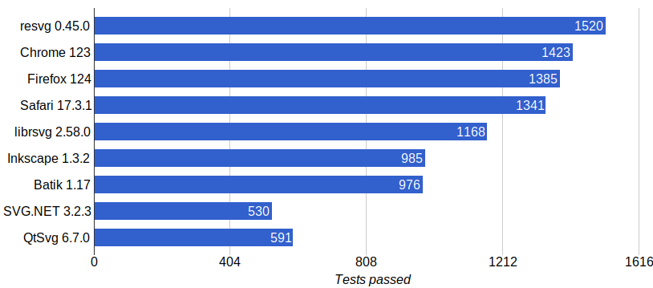

## resvg

*resvg* is an [SVG](https://en.wikipedia.org/wiki/Scalable_Vector_Graphics) rendering library.

## Purpose

*resvg* can be used as:

- a Rust library
- a C library (see [capi](./capi))
- a CLI application (see [tools/rendersvg](./tools/rendersvg))

to render SVG files based on a
[static](http://www.w3.org/TR/SVG11/feature#SVG-static)
[SVG Full 1.1](https://www.w3.org/TR/SVG/Overview.html) subset
(see [SVG support](#svg-support) for details).

The core idea is to make a fast, small, portable, multiple backend SVG library
designed for edge-cases.

SVG can be rendered to a raster image or to a backend's canvas (e.g. to a QWidget via QPainter).

## Why a new library?

*resvg* is trying to compete with [librsvg], [QtSvg]
and [Inkscape] (only as a CLI SVG to PNG converter).

One of the major differences from other rendering libraries is that *resvg* does a lot
of preprocessing before rendering. It converts shapes to paths, resolves attributes,
removes groups and invisible elements, fixes a lot of issues in malformed SVG files.
Then it creates a simple render tree with all elements and attributes resolved.
And only then it starts to render. So it's very easy to implement a new rendering backend.

More details [here](https://github.com/RazrFalcon/usvg/blob/master/docs/usvg_spec.adoc).

### resvg vs librsvg

*librsvg* is the main competitor to the *resvg*. And even though that *librsvg* itself is being
rewritten in Rust, as *resvg*, the architecture of the library is completely different:

- *librsvg*, currently, is heavily tied to the [cairo] library, unlike *resvg*
- *librsvg* is heavily tied to [GNOME] which makes it painful to distribute outside the Linux ecosystem
- *librsvg* doesn't really preprocess input files, rendering them as is
- *librsvg* has a minimal support of the edge-cases, which leads to rendering errors

### resvg vs Inkscape

Inkscape is often used to convert SVG to PNG, but it's not an actual competitor to *resvg*,
since it's still a complete vector editor, not a tiny library.
Also, it's very slow. But it has the best SVG support amongst others.

### resvg vs QtSvg

Without a doubt, [QtSvg] is heavily used in [Qt] applications.
But [QtSvg] itself is very limited. It officially supports only a tiny portion
of the SVG Tiny 1.2 subset. In simple terms - it correctly renders only primitive SVG images.

## SVG support

*resvg* is aiming to support only the [static](http://www.w3.org/TR/SVG11/feature#SVG-static)
SVG subset. E.g. no `a`, `script`, `view`, `cursor` elements, no events and no animations.

Also, `textPath` and
[embedded fonts](https://www.w3.org/TR/SVG11/feature#Font) are not yet implemented.
A full list can be found [here](docs/unsupported.md).

Results of the static subset of the [SVG test suite](https://www.w3.org/Graphics/SVG/Test/20110816/):

Results of the [resvg test suite](https://github.com/RazrFalcon/resvg-test-suite):

You can find a complete table of supported features
[here](https://razrfalcon.github.io/resvg-test-suite/svg-support-table.html).
It also includes alternative libraries.

## Performance

Note that all tested applications have a different SVG support, which impacts the performance.

Also, we do not test against Chrome, Firefox, Inkscape and Batik because they have a huge startup time.

- Elementary Icon Theme contains 3417 files.
- resvg-qt is slow for unknown reasons.

- Oxygen Icon Theme contains 4947 files.
- All images were converted from `.svgz` to `.svg` beforehand.
- `resvg` is slower than `librsvg` because Oxygen Icon Theme is using Gaussian blur heavily, which is expensive.
  And `librsvg` uses box blur optimization and multithreading, while `resvg` always uses a single-threaded IIR blur (at least for now).
- QtSvg doesn't support `filter`, `clipPath`, `mask` and `pattern` that are heavily used in the Oxygen Icon Theme.
  So it's actually very slow.

## Project structure

- `resvg` - rendering backends implementation
  - [`usvg`](./usvg) - an SVG simplification tool
    - [`svgdom`](https://github.com/RazrFalcon/svgdom) - a DOM-like SVG tree
      - [`roxmltree`](https://github.com/RazrFalcon/roxmltree) - a DOM-like XML tree
        - [`xmlparser`](https://github.com/RazrFalcon/xmlparser) - an XML parser
      - [`svgtypes`](https://github.com/RazrFalcon/svgtypes) - SVG types parser and writer
    - [`rctree`](https://github.com/RazrFalcon/rctree) - a DOM-like tree
  - [`resvg-qt`](./resvg-qt) - a minimal bindings to [Qt]

All other dependencies aren't written by me for this project.

## Directory structure

- `capi` - C/FFI interface for *resvg*
- `docs` - basic documentation
- `examples` - *resvg* as a library usage examples
- `resvg-qt` - a minimal bindings to Qt used by *resvg*
- `src` - source code
- `testing_tools` - scripts used for testing
- `tools` - useful CLI tools
- `usvg` - an SVG simplification library used by *resvg*

## Safety

- The library must not panic. Any panic should be considered a critical bug and reported.
  There are only few methods that can produce a panic.
- The core library structure (see above) does not use any `unsafe`,
  but since all backends are implemented via FFI, we are stuck with `unsafe` anyway.

## License

*resvg* is licensed under the [MPLv2.0](https://www.mozilla.org/en-US/MPL/).

[Inkscape]: https://www.inkscape.org
[librsvg]: https://wiki.gnome.org/action/show/Projects/LibRsvg
[QtSvg]: https://doc.qt.io/qt-5/qtsvg-index.html

[cairo]: https://www.cairographics.org/
[Qt]: https://www.qt.io/
[Skia]: https://skia.org/

[GNOME]: https://www.gnome.org/
