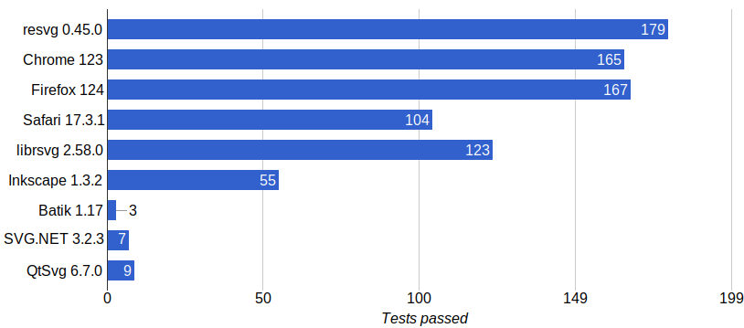

## resvg

*resvg* is an [SVG](https://en.wikipedia.org/wiki/Scalable_Vector_Graphics) rendering library.

It can be used as a Rust library, as a C library, and as a CLI application to render static SVG files.

The core idea is to make a fast, small, portable SVG library with the goal to support the whole SVG spec.

## Features

### Designed for edge-cases

SVG is a very complicated format with a large specification (SVG 1.1 is almost 900 pages).
You basically need a web browser to handle all of it. But the truth is that even browsers
fail at this (see [SVG support](https://github.com/RazrFalcon/resvg#svg-support)).
Yes, unlike `resvg`, browsers do support dynamic SVG features like animations and scripting.
But using a browser to render SVG _correctly_ is sadly not an option.

To prove its correctness, `resvg` has a vast test suite that includes around 1500 tests.
And those are only SVG-to-PNG regression tests. This doesn't include tests in `resvg` dependencies.
And the best thing is that `resvg` test suite is available to everyone. It's not tied to `resvg`
in any way. Which should help people who plan to develop their own SVG libraries.

### Safety

It's hard not to mention safety when we talk about Rust and processing of a random input.
And we're talking not only about SVG/XML, but also about CSS, TTF, PNG, JPEG, GIF, and GZIP.

While `resvg` is not the only SVG library written in Rust, it's the only one that
is written completely in Rust. There is no non-Rust code in the final binary.

Moreover, there is almost no `unsafe` code either. Still, some dependencies have some `unsafe` code
and font memory-mapping is inherently `unsafe`, but it's best you can get in terms of memory safety.

However, this doesn't stop at memory safety. `resvg` has extensive checks to prevent endless loops (freezes)
and stack overflows (via recursion).

### Zero bloat

Right now, the `resvg` CLI application is less than 3MB in size and doesn't require any external dependencies.
The binary contains nothing that isn't needed for rendering SVG files.

### Portable

`resvg` is guaranteed to work everywhere where you can compile the Rust itself,
including WASM. There are some rough edges with obscure CPU architectures and
mobile OSs (mainly system fonts loading), but it should be pretty painless otherwise.

### SVG preprocessing

Another major difference from other SVG rendering libraries is that in `resvg`
SVG parsing and rendering are two completely separate steps.
Those steps are also split into two separate libraries: `resvg` and [usvg].
Meaning you can easily write your own renderer on top of `usvg` using any 2D library of your liking.

### Performance

Comparing performance between different SVG rendering libraries is like comparing apples and oranges.
Everyone has a very different set of supported features, languages, build flags, etc...
Anyhow, as `resvg` is written in Rust and uses [tiny-skia] for rendering - it's pretty fast.
There should also still be quite a lot of room for improvement.

### Reproducibility

Since `resvg` doesn't rely on any system libraries it allows us to have reproducible results
on all supported platforms. Meaning if you render an SVG file on x86 Windows and then render it
on ARM macOS - the produced image will be identical. Each pixel would have the same value.

## Limitations

- No animations 
  There are no plans on implementing them either.
- No native text rendering 
  `resvg` doesn't rely on any system libraries, which implies that we cannot use native text rendering.
  Nevertheless, native text rendering is optimized for small horizontal text, which is not
  that common is SVG.
- Unicode-only 
  It's the 21th century. Text files that aren't UTF-8 encoded are no longer relevant.

## SVG support

`resvg` aims to only support the [static](http://www.w3.org/TR/SVG11/feature#SVG-static)
SVG subset; i.e. no `a`, `script`, `view` or `cursor` elements, no events and no animations.

[SVG 2](https://www.w3.org/TR/SVG2/) support is being worked on.
You can search for relevant issues with the
[svg2 tag](https://github.com/RazrFalcon/resvg/issues?q=is%3Aissue+is%3Aopen+label%3Asvg2)
or our [SVG 2 changelog](https://github.com/RazrFalcon/resvg/blob/master/docs/svg2-changelog.md).

[SVG Tiny 1.2](https://www.w3.org/TR/SVGTiny12/) is not supported and support is also not planned.

Results of the [resvg test suite](./tests/README.md):

SVG 2 only results:

You can find a complete table of supported features
[here](https://razrfalcon.github.io/resvg-test-suite/svg-support-table.html).
It also includes some alternative libraries.

We're not testing against all SVG libraries since many of them are pretty bad.
Some libraries are not on the list because they don't pass the 25% mark.
Such libraries are: wxSvg, LunaSVG and nanosvg.

## resvg project

There is a subtle difference between resvg as a _library_ and resvg as a _project_.
While most users will interact only with the resvg library, it's just a tip of an iceberg.
There are a lot of libraries that I had to write to make resvg possible.
Here are some of them:

- resvg - the actual SVG renderer
- [usvg] - an SVG preprocessor/simplifier
- [tiny-skia] - a [Skia](https://github.com/google/skia) subset ported to Rust
- [rustybuzz] - a [harfbuzz](https://github.com/harfbuzz/harfbuzz) subset ported to Rust
- [ttf-parser] - a TrueType/OpenType font parser
- [fontdb] - a simple, in-memory font database with CSS-like queries
- [roxmltree] + [xmlparser] - an XML parsing libraries
- [simplecss] - a pretty decent CSS 2 parser and selector
- [pico-args] - an absolutely minimal, but surprisingly popular command-line arguments parser

So while the resvg _library_ is deceptively small (around 2500 LOC), the resvg _project_
is nearing 75'000 LOC. Which is not that much considering how much resvg does.
It's definitely the smallest option out there.

## License

`resvg` project is licensed under the [MPLv2.0](https://www.mozilla.org/en-US/MPL/).

[usvg]: https://github.com/RazrFalcon/resvg/tree/master/usvg
[rustybuzz]: https://github.com/RazrFalcon/rustybuzz
[tiny-skia]: https://github.com/RazrFalcon/tiny-skia
[ttf-parser]: https://github.com/RazrFalcon/ttf-parser
[roxmltree]: https://github.com/RazrFalcon/roxmltree
[xmlparser]: https://github.com/RazrFalcon/xmlparser
[simplecss]: https://github.com/RazrFalcon/simplecss
[fontdb]: https://github.com/RazrFalcon/fontdb
[pico-args]: https://github.com/RazrFalcon/pico-args
